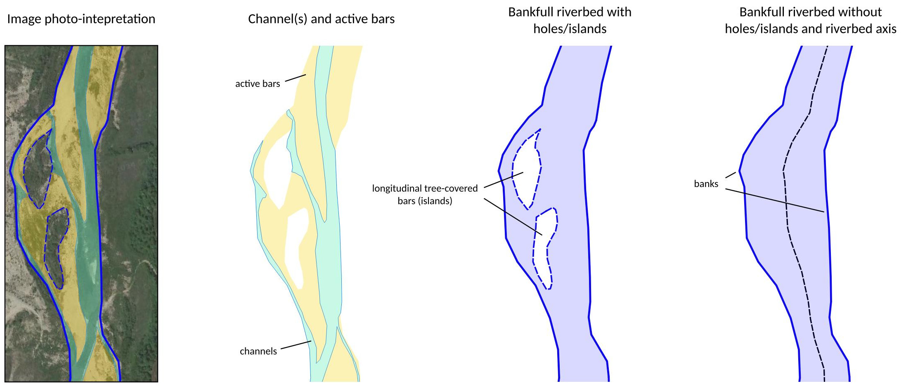

# **RiverMetrics** - Qgis Processing

## Hydromorphological River Metrics Measurements 

A set of tools for extracting river metrics. Useful for identifying the hydro-morphological characteristics and analysing the geomorphological evolution over time of a river.    
It is developed in [Python-3 environment](www.python.org) and is compatible with QGIS 3.22 and later.

The plugin is divided into two parts: the first part is an experimental plugin with a dock in the main QGIS interface, while the second part is a set of tools integrated into QGIS processing.

> [!Note]
> The [RiverMetrics plugin](https://github.com/pierluigiderosa/RiverMetrics.git) is in the official QGIS repository (experimental flag) and can be easily installed using the standard procedure, via the **Plugin Manager**. 

 The QGIS RiverMetrics processing tools can be found here.

---
## :gear: QGIS processing tools

The tools have been grouped into a set called **Hydromorphological Analysis**. The set consists of three tools, two of which are split into two parts. There are five QGIS models listed below:

* [River axis extraction;](README.md#river-axis-extraction)
* Braiding-Width 1 (measure);
* Braiding-Width 2 (reaches mean values);
* Valley confinement index 1 (input data preparation)
* Valley confinement index 2 (calculation).
---
## :brain: How to add the models to the **Processing Toolbox**
Once you have downloaded and unzipped the **zip project file** ([here is an howto](https://docs.github.com/en/get-started/start-your-journey/downloading-files-from-github#downloading-a-repositorys-files)) there are two easy ways to import the models into QGIS.

### 📂 Copy the _.model3_ files in the Processing configuration folder 
The user profile configuration folders are directly accessible from the QGIS interface via the command bar: _Settings/User Profiles/Open Active Profile Folder_.

The models are located in the **project's _"models"_ folder**. They have a _**.model3**_ extension. 
After copying the models files to the 
`.../user/processing/models` folder, you will need to restart the software and the tools will be listed in the Processing Toolbox.

### :toolbox: Adding using the Processing Toolbox button
Alternatively, the models can be added one by one to the Processing Toolbox using the button at the top left.

---
## River Axis Extraction
The riverbed axis is an input to both the RiverMetrics plugin and the _**Braiding-Width 1: measure**_ model.

### :mountain: Concepts of river geomorphology
In geomorphology, the axis of the riverbed is defined as the median line formed by the points at the same distance from the banks. The axis is determined from the polygon of the bankfull riverbed.

The bankfull riverbed can be identified from remotely sensed imagery and includes the channel(s) and the active (bare or sparsely vegetated) bars. The banks separate it from the floodplain and form its boundary. Also excluded are bars with tree vegetation, which are not considered active because they do not participate in bed load transport (Fig.1).

### 🛠️ Model operation

The first operation performed by the model is to eliminate from the polygon of the bankfull riverbed the holes caused by the presence of longitudinal tree-covered bars, known as 'islands'. This requires a threshold (maximum area - Sistem Reference units2), which is set to 5000 by default.

The axis is obtained by a process of "skeletonisation" of the polygon using the GRASS gis _**v.voronoi** [^1]_ tool present in the Processing Toolbox.
[^1]: [GRASS gis manual pages](https://grass.osgeo.org/grass83/manuals/v.voronoi.html)

As the line obtained may be excessively fragmented, a simplification is carried out to remove nodes that are closer than a threshold (Sistem Reference units) defined by the user. The default value is 1.

As the resulting line may be split into several parts, the initial vertices of the lines are extracted to facilitate identification of the different parts. For use as input to the **Rivermetrics plugin** and the **Braiding-Width1 model**, these line segments must then be **manually joined together** by the user (editing operation) to obtain a **single line** of a **single part** layer.

<!-- La figura è stata fatta con il file POA-abdac/chiascio_51-52.qgz, ho provato anche un SVG che funziona con qualche accorgimento (rettangoli bianchi a coprire i vettoriali). Sembra lento a renderizzare perciò ho ricollegato una JPG -->

### 🔄 Input/Output data

| Input parameter | Type | Description |
| --- | --- | --- |
| Effective bankfull stage riverbed | Polygon (singleparts)| Bankfull riverbed polygon. Holes (islands) are allowed and will be removed. The attribute table does not require any additional information other than the feature ID |
| Minimum area for hole removale | User input (system reference units2 - e.g. _m2_) | Threshold (maximum area) for removing holes. Too high values can cause the polygon to collapse and should be avoided. The value should be based on the larger hole/island. Set to 5000 by default.|
| Tolerance for axis semplification | User input (system reference units - e.g. _m_) | Threshold for axis line semplyfication. Represent the distance below which nodes that are too close are removed. Set to 1 by default |

| Output data | Type | Description |
| --- | --- | --- |
| River axis | LineString (singleparts)| Linear vector of the river bed axis. For use as input to the **Rivermetrics plugin** and the **Braiding-Width1 model**, several line segments, if present, may need to be successively joined together by the user (editing operation) |
| Non-simplified axis | LineString (singleparts) |  Raw axis line. It can be excessively fragmented  (_v.voronoi_ output) |
| Initial vertices | Point | Initial vertices of the axis line parts, if split. Created to help locate the different parts of the axis line |
| Bankfull riverbed | Polygon (singleparts) | Bankfull riverbed without holes/islands. It is the result of the hole removal process |
