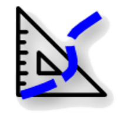

# **RiverMetrics** - Qgis Processing

## Hydromorphological River Metrics Measurements 

A set of tools for extracting river metrics. Useful for identifying the hydro-morphological characteristics and analysing the geomorphological evolution over time of a river.    
It is developed in [Python-3 environment](www.python.org) and is compatible with QGIS 3.22 and later.

The plugin is divided into two parts: the first part is an experimental plugin with a dock in the main QGIS interface, while the second part is a set of tools integrated into QGIS processing.

> [!Note]
> The [RiverMetrics plugin](https://github.com/pierluigiderosa/RiverMetrics.git) is in the official QGIS repository (experimental flag) and can be easily installed using the standard procedure. 

 The QGIS RiverMetrics processing tools can be found here.

---
## QGIS processing tools

The tools have been grouped into a set called **RM Hydromorphological Analysis**. The set consists of three tools, two of which are split into two parts. There are five QGIS models listed below:

* River axis extraction;
* Braiding-width 1: measure;
* Braiding-width 2: reaches mean values;
* Valley confinement index 1: input data preparation
* Valley confinement index 2: calculation.
---
## How to install into the **QGIS processing panel**
Once you have downloaded and unzipped the **zip project file** (green code button at the top right of the page) there are two easy ways to import the models into QGIS.

### Copyng the _.model3_ files in the Processing configuration folder 
The user profile configuration folders are directly accessible from the QGIS interface via the command bar: _Settings/User Profiles/Open Active Profile Folder_.

The models are located in the **project's _"models"_ folder**. They have a _**.model3**_ extension. 
After copying the models files to the 
`.../user/processing/models` folder, you will need to restart the software and the tools will be listed in the Processing Toolbox.

### Adding using the Processing Toolbox button
Alternatively, the models can be added one by one to the Processing Toolbox using the button at the top left.

